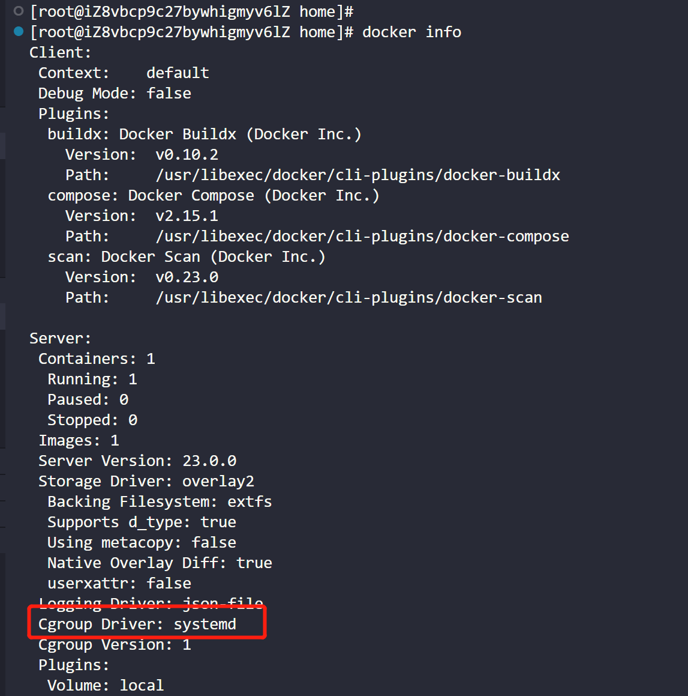

# Docker & Kubernetes安装

---

# 1.安装docker

## 1.运行docker_install.sh

[install-docker.sh](install_file/docker/install-docker.sh)


## 2.配置docker镜像加速器

通过修改daemon配置文件/etc/docker/daemon.json来使用加速器

```bash
sudo mkdir -p /etc/docker
sudo tee /etc/docker/daemon.json <<-'EOF'
{
  "registry-mirrors": ["填写自己的加速地址"]
}
EOF
sudo systemctl daemon-reload
sudo systemctl restart docker
```

## 3.修改docker Cgroup Driver

docker在默认情况下使用的 Cgroup Driver 为 cgroupfs,而 Kubernetes 其实推荐使用 systemd 来代替 cgroupfs

```bash
sudo mkdir -p /etc/docker
sudo tee /etc/docker/daemon.json <<-'EOF'
{
  "exec-opts": ["native.cgroupdriver=systemd"]
}
EOF
sudo systemctl daemon-reload
sudo systemctl restart docker
```

查看修改是否生效

```bash
docker info
```



---

# 2.安装Kubernetes
